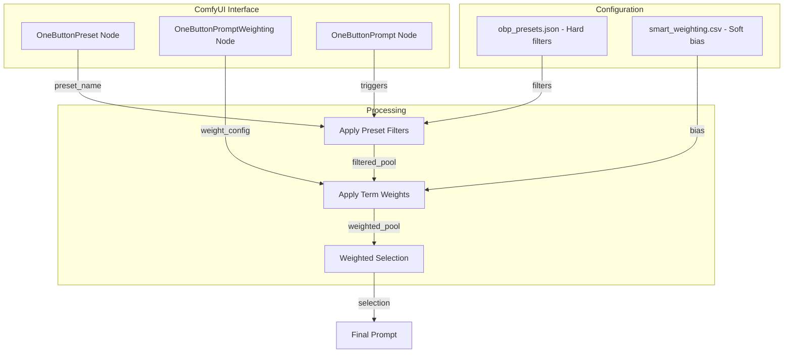

# Smart Weighting & UI Integration Plan (Phase 5) - Refined v2

## Executive Summary

This plan defines a **term-level probability biasing system** that **complements** (not replaces) the existing OneButtonPreset system. 

**Key Distinction:**
- **OneButtonPreset**: Hard filters and generation parameters ("what to generate")
- **Smart Weighting**: Soft probability biasing within those choices ("how likely each option is")

---

## 1. System Comparison

### 1.1 OneButtonPreset (Existing - Hard Filters)

```json
{
  "Architecture Focus": {
    "artist": "architecture",      // ONLY architecture artists
    "subject": "landscape",        // ONLY landscapes
    "insanitylevel": 6
  }
}
```

**Effect**: Binary inclusion/exclusion. When `artist: "architecture"`, the artist pool is **filtered** to only architecture artists.

### 1.2 Smart Weighting (New - Soft Bias)

```csv
type,target,weight,comment
term,Greg Rutkowski,0.1,Reduce overused artist
term,cinematic lighting,2.0,Boost popular lighting
term,rule of thirds,1.5,Favor this composition
```

**Effect**: Probability adjustment. Greg Rutkowski is still in the pool, but 10x less likely to be selected.

### 1.3 How They Work Together

```
OneButtonPreset: artist="all", subject="humanoid"
                    ↓
            All artists in pool, human subjects
                    ↓
Smart Weighting: Greg Rutkowski=0.1, Alphonse Mucha=2.0
                    ↓
            Greg rarely selected, Mucha 2x more likely
                    ↓
            Result: Human subject with Mucha-style art
```

---

## 2. Refined Scope - Term-Level Only

### 2.1 What Smart Weighting DOES

| Weight Type | Example | Effect |
|-------------|---------|--------|
| **term** | `Greg Rutkowski: 0.1` | 10% selection chance |
| **term** | `cinematic lighting: 2.0` | 200% selection chance |
| **term** | `dragon: 0.0` | Never selected (soft block) |

### 2.2 What Smart Weighting DOES NOT Do

| Feature | Reason | Use Instead |
|---------|--------|-------------|
| Category weights | Duplicates OneButtonPreset | `artist: "fantasy"` in preset |
| Subject filtering | Duplicates OneButtonPreset | `subject: "landscape"` in preset |
| Image type forcing | Duplicates OneButtonPreset | `imagetype: "photograph"` in preset |
| Insanity level | Duplicates OneButtonPreset | `insanitylevel: 7` in preset |

---

## 3. Technical Architecture

### 3.1 Data Flow Diagram



### 3.2 SmartWeighter Class (Simplified)

```python
# Location: smart_weighter.py (new file)

class SmartWeighter:
    """
    Applies term-level probability weights.
    
    Complements OneButtonPreset by biasing selection within
    the filtered pools that presets create.
    """
    
    _instance = None
    
    def __new__(cls):
        if cls._instance is None:
            cls._instance = super().__new__(cls)
            cls._instance._load_weights()
        return cls._instance
    
    def _load_weights(self):
        """Load term weights from CSV files."""
        self.term_weights = {}
        
        # Load base weights
        base_path = "./userfiles/smart_weighting.csv"
        if os.path.exists(base_path):
            self._parse_weight_file(base_path)
        
        # Load addon weights (follows OBP pattern)
        addon_path = "./userfiles/smart_weighting_addon.csv"
        if os.path.exists(addon_path):
            self._parse_weight_file(addon_path)
    
    def _parse_weight_file(self, path):
        """Parse weight CSV: term,target,weight,comment"""
        with open(path, 'r', encoding='utf-8') as f:
            reader = csv.DictReader(f)
            for row in reader:
                if row['type'] == 'term':
                    key = row['target'].lower().strip()
                    self.term_weights[key] = float(row['weight'])
    
    def get_term_weight(self, term):
        """Get weight for a specific term. Returns 1.0 if not found."""
        return self.term_weights.get(term.lower().strip(), 1.0)
    
    def weighted_choice(self, items):
        """
        Make a weighted random selection from a list.
        
        Args:
            items: List of strings to choose from
            
        Returns:
            Selected item (or None if all weights are 0)
        """
        if not items:
            return None
        
        # Build weights list
        weights = [self.get_term_weight(item) for item in items]
        
        # Filter out zero-weight items
        valid_indices = [i for i, w in enumerate(weights) if w > 0]
        
        if not valid_indices:
            # All items have zero weight - log warning and pick randomly
            print(f"Warning: All items have zero weight, falling back to random")
            return random.choice(items)
        
        valid_items = [items[i] for i in valid_indices]
        valid_weights = [weights[i] for i in valid_indices]
        
        return random.choices(valid_items, weights=valid_weights, k=1)[0]
    
    def reload(self):
        """Force reload of weights (hot-reload)."""
        self._load_weights()
```

### 3.3 Configuration File Format

**Location**: `userfiles/smart_weighting.csv`

```csv
type,target,weight,comment
# Term weights - adjust probability of specific terms
term,Greg Rutkowski,0.1,Reduce overused artist
term,Alphonse Mucha,2.0,Boost elegant style
term,cinematic lighting,1.5,Favor cinematic look
term,dramatic lighting,1.5,Favor dramatic look
term,flat lighting,0.3,Reduce flat lighting
term,rule of thirds,1.3,Common composition boost
term,bokeh,1.4,Popular photography effect
term,dragon,0.2,Reduce fantasy creature
term,elf,0.2,Reduce fantasy creature
term,spaceship,0.2,Reduce sci-fi vehicle
```

**Addon File**: `userfiles/smart_weighting_addon.csv` (same format, appends/overrides)

---

## 4. Integration Points

### 4.1 replacewildcard() Modification

```python
# In build_dynamic_prompt.py, modify replacewildcard() at line 4537

def replacewildcard(completeprompt, insanitylevel, wildcard, listname, 
                    activatehybridorswap, advancedprompting, 
                    artiststyleselector="", _metadata=None, metadata_key=None,
                    smart_weighter=None):  # NEW OPTIONAL PARAMETER
    
    if len(listname) == 0:
        completeprompt = completeprompt.replace(wildcard, "", 1)
    else:
        while wildcard in completeprompt:
            # ... hybrid/swap logic unchanged ...
            
            if bool(listname):
                # Use weighted selection if SmartWeighter provided
                if smart_weighter is not None:
                    replacementvalue = smart_weighter.weighted_choice(listname)
                else:
                    replacementvalue = random.choice(listname)
                
                # ... rest of function unchanged ...
```

### 4.2 build_dynamic_prompt() Modification

```python
# Add parameter to function signature at line 28

def build_dynamic_prompt(
    insanitylevel=5, forcesubject="all", artists="all", imagetype="all",
    # ... existing parameters ...
    smart_weighting=False,  # NEW: Enable/disable smart weighting
    # ... rest of parameters ...
):
    # Initialize SmartWeighter if enabled
    smart_weighter = SmartWeighter() if smart_weighting else None
    
    # ... existing code ...
    
    # Pass to replacewildcard calls
    completeprompt = replacewildcard(
        completeprompt, insanitylevel, "-artist-", artistlist, 
        False, False, "", _metadata, "chosen_artist",
        smart_weighter=smart_weighter  # NEW
    )
```

### 4.3 ComfyUI Node

```python
class OneButtonPromptWeighting:
    """
    Configures term-level probability weights.
    
    Use alongside OneButtonPreset:
    - OneButtonPreset: Sets hard filters (artist category, subject type)
    - This node: Adjusts probabilities within those filters
    """
    
    @classmethod
    def INPUT_TYPES(s):
        return {
            "required": {
                "enable_weighting": ("BOOLEAN", {
                    "default": True,
                    "tooltip": "Enable/disable smart weighting"
                }),
            },
            "optional": {
                "custom_weights": ("STRING", {
                    "multiline": True,
                    "default": "",
                    "tooltip": "Override weights, one per line: term:weight (e.g., 'Greg Rutkowski:0.1')"
                }),
                "reload_weights": ("BOOLEAN", {
                    "default": False,
                    "tooltip": "Force reload of weight configuration"
                }),
            },
        }
    
    RETURN_TYPES = ("SMART_WEIGHT_CONFIG",)
    RETURN_NAMES = ("weight_config",)
    FUNCTION = "configure_weights"
    CATEGORY = "OneButtonPrompt"
    
    def configure_weights(self, enable_weighting, custom_weights, reload_weights):
        if reload_weights:
            SmartWeighter().reload()
        
        # Parse custom overrides
        overrides = {}
        if custom_weights:
            for line in custom_weights.strip().split('\n'):
                if line and not line.startswith('#'):
                    parts = line.split(':')
                    if len(parts) == 2:
                        term, weight = parts
                        overrides[term.strip().lower()] = float(weight)
        
        return ({
            "enabled": enable_weighting,
            "overrides": overrides
        },)
```

---

## 5. Example Use Cases

### 5.1 Reducing Overused Artists

**Problem**: Greg Rutkowski appears too often in generations.

**OneButtonPreset approach** (hard filter):
```json
{"artist": "all"}  // Can't reduce just Greg
```

**Smart Weighting approach** (soft bias):
```csv
term,Greg Rutkowski,0.1
```
Result: Greg still appears, but 10x less frequently.

### 5.2 Boosting Preferred Lighting Styles

**Problem**: User prefers cinematic/dramatic lighting over flat lighting.

**OneButtonPreset approach** (can't do this):
```json
// No way to bias specific lighting terms
```

**Smart Weighting approach**:
```csv
term,cinematic lighting,2.0
term,dramatic lighting,2.0
term,flat lighting,0.3
```
Result: Cinematic/dramatic 2x more likely, flat 3x less likely.

### 5.3 Soft-Blocking Fantasy Terms

**Problem**: User wants less fantasy but doesn't want to eliminate it entirely.

**OneButtonPreset approach** (hard filter):
```json
{"artist": "all"}  // Can't filter fantasy terms specifically
```

**Smart Weighting approach**:
```csv
term,dragon,0.2
term,elf,0.2
term,unicorn,0.2
term,wizard,0.2
```
Result: Fantasy terms still appear, but 5x less frequently.

### 5.4 Combined Workflow

```
┌─────────────────────────────────────────────────────────────┐
│ OneButtonPreset: "Portrait Photography"                     │
│   - artist: "photography"                                   │
│   - subject: "humanoid"                                     │
│   - imagetype: "photograph"                                 │
└─────────────────────────────────────────────────────────────┘
                              ↓
┌─────────────────────────────────────────────────────────────┐
│ Smart Weighting: "My Preferences"                           │
│   - Annie Leibovitz: 2.0                                    │
│   - Steve McCurry: 1.5                                      │
│   - bokeh: 1.5                                              │
│   - dramatic lighting: 1.3                                  │
└─────────────────────────────────────────────────────────────┘
                              ↓
┌─────────────────────────────────────────────────────────────┐
│ Result: Portrait photograph with photography-style artists, │
│         biased toward Leibovitz/McCurry, with bokeh and     │
│         dramatic lighting more likely to appear             │
└─────────────────────────────────────────────────────────────┘
```

---

## 6. Implementation Steps

### Session 1: Core Infrastructure
1. Create `smart_weighter.py` with SmartWeighter class
2. Create `userfiles/smart_weighting_sample.csv` template
3. Add `smart_weighting` parameter to `build_dynamic_prompt()`
4. Modify `replacewildcard()` to use weighted selection
5. Unit tests for weight application

### Session 2: ComfyUI Integration
1. Create `OneButtonPromptWeighting` node
2. Update `OneButtonPrompt` node to accept weight config
3. Add tooltips explaining relationship to OneButtonPreset
4. Integration testing with existing presets

### Session 3: Documentation & Polish
1. Update README with Smart Weighting section
2. Document the distinction from OneButtonPreset
3. Create example workflows
4. Performance benchmarking

---

## 7. Summary of Changes from Previous Plan

| Aspect | Previous Plan | This Plan |
|--------|---------------|-----------|
| Weight Types | wildcard, term, category | **term only** |
| Category Weights | Yes (duplicates preset) | **Removed** |
| Wildcard Weights | Yes (duplicates preset) | **Removed** |
| Preset System | New parallel system | **Complements existing** |
| Default Presets | 5 preset files | **None needed** - single CSV |
| Positioning | Replacement for presets | **Complement to presets** |

This refined plan ensures Smart Weighting fills a gap in OBP's capabilities without duplicating functionality that OneButtonPreset already handles well.